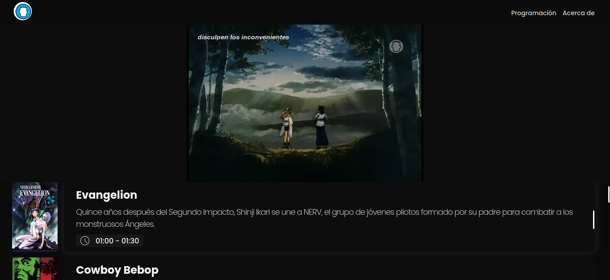

# Locomotion TV - Next JS Sample


## :information_source: About

> ...

### :rocket: Check the site

[Locomotion TV NEXT](https://locomotion-tv-next.vercel.app/)

---

### :camera: Pics



### :computer: System Requirements

- Node.js 14.0 or later
- MacOS, Windows (including WSL), and Linux are supported

### 🔧 Setup

```
1. npm i
2. npm run dev
```

### :pushpin: Built with

- React + NEXT.JS
- Prisma + CockroachDB
- styled-components
- luxon
- swr
- etc.

### :scroll: License

[GPL-3.0 License](https://github.com/falsepopsky/locomotion-tv-next/blob/main/LICENSE)

#### :open_file_folder: Folder Structure

<div style="margin: 20px 0;">

    .
    ├── vscode
    ├── docs
    ├── prisma
    ├── public
    │   ├── banners
    │   └── ...
    ├── src
    │   ├── data
    │   ├── components
    │   │   └── ...
    │   ├── pages
    │   │   ├── api
    │   │   └── ...
    │   └── utils
    └── LICENSE

</div>
